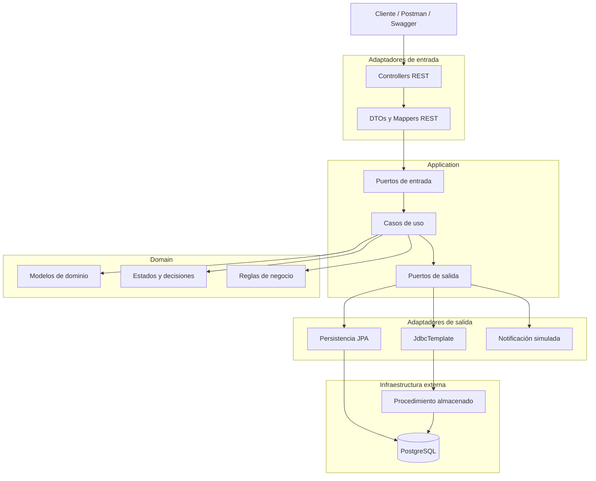

# Arquitectura del sistema

El proyecto utiliza Arquitectura Hexagonal para mantener separadas las reglas de
negocio de los detalles técnicos como Spring, PostgreSQL, JPA y los controladores
REST.

